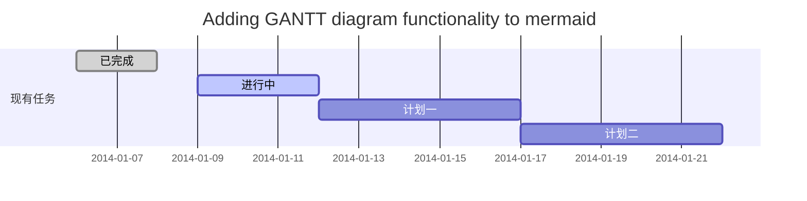
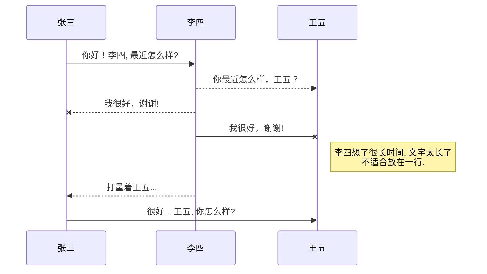
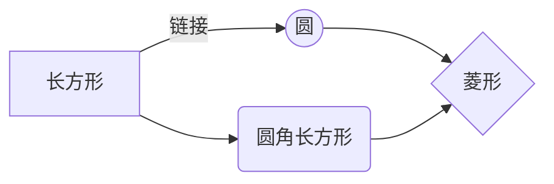

@[TOC](MarkDown学习)

# 1. Usefull website
* [Markdown 语法说明](http://www.appinn.com/markdown/)
* [Markdown——入门指南](http://www.jianshu.com/p/1e402922ee32/)
* [有道云笔记Markdown指南](http://note.youdao.com/iyoudao/?p=2445)
* [Cmd Markdown 公式指导手册](https://www.zybuluo.com/codeep/note/163962)
* [MathJax basic tutorial and quick reference](https://math.meta.stackexchange.com/questions/5020/mathjax-basic-tutorial-and-quick-reference)

----------------------
# 2. **CSDN markdown**

# 欢迎使用Markdown编辑器

你好！ 这是你第一次使用 **Markdown编辑器** 所展示的欢迎页。如果你想学习如何使用Markdown编辑器, 可以仔细阅读这篇文章，了解一下Markdown的基本语法知识。

## 新的改变

我们对Markdown编辑器进行了一些功能拓展与语法支持，除了标准的Markdown编辑器功能，我们增加了如下几点新功能，帮助你用它写博客：

 1. **全新的界面设计** ，将会带来全新的写作体验；
 2. 在创作中心设置你喜爱的代码高亮样式，Markdown **将代码片显示选择的高亮样式** 进行展示；
 3. 增加了 **图片拖拽** 功能，你可以将本地的图片直接拖拽到编辑区域直接展示；
 4. 全新的 **KaTeX数学公式** 语法；
 5. 增加了支持**甘特图的mermaid语法[^1]** 功能；
 6. 增加了 **多屏幕编辑** Markdown文章功能；
 7. 增加了 **焦点写作模式、预览模式、简洁写作模式、左右区域同步滚轮设置** 等功能，功能按钮位于编辑区域与预览区域中间；
 8. 增加了 **检查列表** 功能。
 [^1]: [mermaid语法说明](https://mermaidjs.github.io/)

## 功能快捷键

撤销：<kbd>Ctrl/Command</kbd> + <kbd>Z</kbd>
重做：<kbd>Ctrl/Command</kbd> + <kbd>Y</kbd>
加粗：<kbd>Ctrl/Command</kbd> + <kbd>B</kbd>
斜体：<kbd>Ctrl/Command</kbd> + <kbd>I</kbd>
标题：<kbd>Ctrl/Command</kbd> + <kbd>Shift</kbd> + <kbd>H</kbd>
无序列表：<kbd>Ctrl/Command</kbd> + <kbd>Shift</kbd> + <kbd>U</kbd>
有序列表：<kbd>Ctrl/Command</kbd> + <kbd>Shift</kbd> + <kbd>O</kbd>
检查列表：<kbd>Ctrl/Command</kbd> + <kbd>Shift</kbd> + <kbd>C</kbd>
插入代码：<kbd>Ctrl/Command</kbd> + <kbd>Shift</kbd> + <kbd>K</kbd>
插入链接：<kbd>Ctrl/Command</kbd> + <kbd>Shift</kbd> + <kbd>L</kbd>
插入图片：<kbd>Ctrl/Command</kbd> + <kbd>Shift</kbd> + <kbd>G</kbd>


## 合理的创建标题，有助于目录的生成

直接输入1次<kbd>#</kbd>，并按下<kbd>space</kbd>后，将生成1级标题。
输入2次<kbd>#</kbd>，并按下<kbd>space</kbd>后，将生成2级标题。
以此类推，我们支持6级标题。有助于使用`TOC`语法后生成一个完美的目录。


## 如何改变文本的样式

*强调文本* _强调文本_

**加粗文本** __加粗文本__

==标记文本==

~~删除文本~~

> 引用文本

H~2~O is是液体。

2^10^ 运算结果是 1024.


## 插入链接与图片

链接: [link](https://mp.csdn.net).

图片: 

带尺寸的图片: 

居中的图片: 

居中并且带尺寸的图片: 

当然，我们为了让用户更加便捷，我们增加了图片拖拽功能。


## 如何插入一段漂亮的代码片

去[博客设置](https://mp.csdn.net/configure)页面，选择一款你喜欢的代码片高亮样式，下面展示同样高亮的 `代码片`.
```javascript
// An highlighted block
var foo = 'bar';
```


## 生成一个适合你的列表

- 项目
  - 项目
    - 项目

1. 项目1
2. 项目2
3. 项目3

- [ ] 计划任务
- [x] 完成任务

## 创建一个表格
一个简单的表格是这么创建的：
项目     | Value
-------- | -----
电脑  | $1600
手机  | $12
导管  | $1

### 设定内容居中、居左、居右
使用`:---------:`居中
使用`:----------`居左
使用`----------:`居右
| 第一列       | 第二列         | 第三列        |
|:-----------:| -------------:|:-------------|
| 第一列文本居中 | 第二列文本居右  | 第三列文本居左 | 


### SmartyPants
SmartyPants将ASCII标点字符转换为“智能”印刷标点HTML实体。例如：
|    TYPE   |ASCII                          |HTML                         
|----------------|-------------------------------|-----------------------------|
|Single backticks|`'Isn't this fun?'`            |'Isn't this fun?'            |
|Quotes          |`"Isn't this fun?"`            |"Isn't this fun?"            |
|Dashes          |`-- is en-dash, --- is em-dash`|-- is en-dash, --- is em-dash|


## 创建一个自定义列表
Markdown
:  Text-to-HTML conversion tool

Authors
:  John
:  Luke


## 如何创建一个注脚

一个具有注脚的文本。[^2]

[^2]: 注脚的解释


##  注释也是必不可少的

Markdown将文本转换为 HTML。

*[HTML]:   超文本标记语言


## KaTeX数学公式

您可以使用渲染LaTeX数学表达式 [KaTeX](https://khan.github.io/KaTeX/):

Gamma公式展示 $\Gamma(n) = (n-1)!\quad\forall
n\in\mathbb N$ 是通过欧拉积分

$$
\Gamma(z) = \int_0^\infty t^{z-1}e^{-t}dt\,.
$$

> 你可以找到更多关于的信息 **LaTeX** 数学表达式[here][1].


## 新的甘特图功能，丰富你的文章


- 关于 **甘特图** 语法，参考 [这儿][2],

## UML 图表

可以使用UML图表进行渲染。 [Mermaid](https://mermaidjs.github.io/). 例如下面产生的一个序列图：:



这将产生一个流程图。:



- 关于 **Mermaid** 语法，参考 [这儿][3],

## FLowchart流程图

我们依旧会支持flowchart的流程图：
```mermaid
flowchat
st=>start: 开始
e=>end: 结束
op=>operation: 我的操作
cond=>condition: 确认？

st->op->cond
cond(yes)->e
cond(no)->op
```

- 关于 **Flowchart流程图** 语法，参考 [这儿][4].


## 导出与导入

###  导出
如果你想尝试使用此编辑器, 你可以在此篇文章任意编辑。当你完成了一篇文章的写作, 在上方工具栏找到 **文章导出** ，生成一个.md文件或者.html文件进行本地保存。

### 导入
如果你想加载一篇你写过的.md文件或者.html文件，在上方工具栏可以选择导入功能进行对应扩展名的文件导入，
继续你的创作。

 [1]: http://meta.math.stackexchange.com/questions/5020/mathjax-basic-tutorial-and-quick-reference
 [2]: https://mermaidjs.github.io/
 [3]: https://mermaidjs.github.io/
 [4]: http://adrai.github.io/flowchart.js/


------------------
# 3. 马克飞象 markdown
# 欢迎使用马克飞象

@(示例笔记本)[马克飞象|帮助|Markdown]

**马克飞象**是一款专为印象笔记（Evernote）打造的Markdown编辑器，通过精心的设计与技术实现，配合印象笔记强大的存储和同步功能，带来前所未有的书写体验。特点概述：
 
- **功能丰富** ：支持高亮代码块、*LaTeX* 公式、流程图，本地图片以及附件上传，甚至截图粘贴，工作学习好帮手；
- **得心应手** ：简洁高效的编辑器，提供[桌面客户端][1]以及[离线Chrome App][2]，支持移动端 Web；
- **深度整合** ：支持选择笔记本和添加标签，支持从印象笔记跳转编辑，轻松管理。

-------------------

[TOC]

## Markdown简介

> Markdown 是一种轻量级标记语言，它允许人们使用易读易写的纯文本格式编写文档，然后转换成格式丰富的HTML页面。    —— [维基百科](https://zh.wikipedia.org/wiki/Markdown)

正如您在阅读的这份文档，它使用简单的符号标识不同的标题，将某些文字标记为**粗体**或者*斜体*，创建一个[链接](http://www.example.com)或一个脚注[^demo]。下面列举了几个高级功能，更多语法请按`Ctrl + /`查看帮助。 

### 代码块
``` python
@requires_authorization
def somefunc(param1='', param2=0):
    '''A docstring'''
    if param1 > param2: # interesting
        print 'Greater'
    return (param2 - param1 + 1) or None
class SomeClass:
    pass
>>> message = '''interpreter
... prompt'''
```
### LaTeX 公式

可以创建行内公式，例如 $\Gamma(n) = (n-1)!\quad\forall n\in\mathbb N$。或者块级公式：

$$	x = \dfrac{-b \pm \sqrt{b^2 - 4ac}}{2a} $$

### 表格
| Item      |    Value | Qty  |
| :-------- | --------:| :--: |
| Computer  | 1600 USD |  5   |
| Phone     |   12 USD |  12  |
| Pipe      |    1 USD | 234  |

### 流程图
```flow
st=>start: Start
e=>end
op=>operation: My Operation
cond=>condition: Yes or No?

st->op->cond
cond(yes)->e
cond(no)->op
```

以及时序图:

```sequence
Alice->Bob: Hello Bob, how are you?
Note right of Bob: Bob thinks
Bob-->Alice: I am good thanks!
```

> **提示：**想了解更多，请查看**流程图**[语法][3]以及**时序图**[语法][4]。

### 复选框

使用 `- [ ]` 和 `- [x]` 语法可以创建复选框，实现 todo-list 等功能。例如：

- [x] 已完成事项
- [ ] 待办事项1
- [ ] 待办事项2

> **注意：**目前支持尚不完全，在印象笔记中勾选复选框是无效、不能同步的，所以必须在**马克飞象**中修改 Markdown 原文才可生效。下个版本将会全面支持。


## 印象笔记相关

### 笔记本和标签
**马克飞象**增加了`@(笔记本)[标签A|标签B]`语法, 以选择笔记本和添加标签。 **绑定账号后**， 输入`(`自动会出现笔记本列表，请从中选择。

### 笔记标题
**马克飞象**会自动使用文档内出现的第一个标题作为笔记标题。例如本文，就是第一行的 `欢迎使用马克飞象`。

### 快捷编辑
保存在印象笔记中的笔记，右上角会有一个红色的编辑按钮，点击后会回到**马克飞象**中打开并编辑该笔记。
>**注意：**目前用户在印象笔记中单方面做的任何修改，马克飞象是无法自动感知和更新的。所以请务必回到马克飞象编辑。

### 数据同步
**马克飞象**通过**将Markdown原文以隐藏内容保存在笔记中**的精妙设计，实现了对Markdown的存储和再次编辑。既解决了其他产品只是单向导出HTML的单薄，又规避了服务端存储Markdown带来的隐私安全问题。这样，服务端仅作为对印象笔记 API调用和数据转换之用。

 >**隐私声明：用户所有的笔记数据，均保存在印象笔记中。马克飞象不存储用户的任何笔记数据。**

### 离线存储
**马克飞象**使用浏览器离线存储将内容实时保存在本地，不必担心网络断掉或浏览器崩溃。为了节省空间和避免冲突，已同步至印象笔记并且不再修改的笔记将删除部分本地缓存，不过依然可以随时通过`文档管理`打开。

> **注意：**虽然浏览器存储大部分时候都比较可靠，但印象笔记作为专业云存储，更值得信赖。以防万一，**请务必经常及时同步到印象笔记**。

## 编辑器相关
### 设置
右侧系统菜单（快捷键`Ctrl + M`）的`设置`中，提供了界面字体、字号、自定义CSS、vim/emacs 键盘模式等高级选项。

### 快捷键

帮助    `Ctrl + /`
同步文档    `Ctrl + S`
创建文档    `Ctrl + Alt + N`
最大化编辑器    `Ctrl + Enter`
预览文档 `Ctrl + Alt + Enter`
文档管理    `Ctrl + O`
系统菜单    `Ctrl + M` 

加粗    `Ctrl + B`
插入图片    `Ctrl + G`
插入链接    `Ctrl + L`
提升标题    `Ctrl + H`

## 关于收费

**马克飞象**为新用户提供 10 天的试用期，试用期过后需要[续费](maxiang.info/vip.html)才能继续使用。未购买或者未及时续费，将不能同步新的笔记。之前保存过的笔记依然可以编辑。


## 反馈与建议
- 微博：[@马克飞象](http://weibo.com/u/2788354117)，[@GGock](http://weibo.com/ggock "开发者个人账号")
- 邮箱：<hustgock@gmail.com>

---------
感谢阅读这份帮助文档。请点击右上角，绑定印象笔记账号，开启全新的记录与分享体验吧。


[^demo]: 这是一个示例脚注。请查阅 [MultiMarkdown 文档](https://github.com/fletcher/MultiMarkdown/wiki/MultiMarkdown-Syntax-Guide#footnotes) 关于脚注的说明。 **限制：** 印象笔记的笔记内容使用 [ENML][5] 格式，基于 HTML，但是不支持某些标签和属性，例如id，这就导致`脚注`和`TOC`无法正常点击。


  [1]: http://maxiang.info/client_zh
  [2]: https://chrome.google.com/webstore/detail/kidnkfckhbdkfgbicccmdggmpgogehop
  [3]: http://adrai.github.io/flowchart.js/
  [4]: http://bramp.github.io/js-sequence-diagrams/
  [5]: https://dev.yinxiang.com/doc/articles/enml.php
